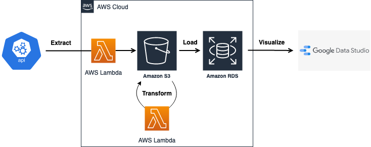

Presents housing violation data from the City of Boston as a data engineering resume project

Under construction.

The City of Boston provides API access to records of housing regulation violations by property, updated daily.

I built a Google Data Studio dashboard for aggregate and individual record search functionality and observability, fed through a data pipeline comprising of raw data stored in AWS S3, Lambda events of python calling the Boston.gov API to pull the daily updates and extracted to S3. EventBridge then triggers additional python in Lambda to transform the data, which is then loaded into a PostgreSQL DB on RDS. GDS allows for integration with AWS RDS: all infrastructure is provisioned programmatically with AWS CDK